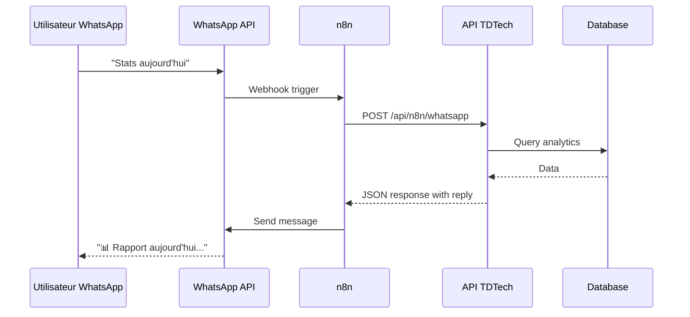

# Agent IA WhatsApp avec n8n - Guide de Configuration

Ce guide explique comment configurer l'agent IA WhatsApp pour analyser les statistiques de ton site en temps réel.

## Architecture

```
┌─────────────┐     ┌─────────────┐     ┌─────────────────────┐
│  WhatsApp   │────▶│    n8n      │────▶│   API TDTech        │
│  Business   │◀────│  Workflow   │◀────│   /api/n8n/whatsapp │
└─────────────┘     └─────────────┘     └─────────────────────┘
                                                  │
                                                  ▼
                                        ┌─────────────────────┐
                                        │   PostgreSQL        │
                                        │   Analytics DB      │
                                        └─────────────────────┘
```

## Prérequis

1. **Compte WhatsApp Business** (ou Twilio/Meta Business API)
2. **Instance n8n** (self-hosted ou cloud.n8n.io)
3. **Site TDTech déployé** avec les nouvelles API

## Configuration des Variables d'Environnement

Ajoute ces variables à ton `.env` :

```env
# Clé API pour sécuriser les webhooks n8n
N8N_API_KEY=ta_cle_secrete_ici

# Optionnel: Pour les logs détaillés
DEBUG_ANALYTICS=true
```

## Endpoints API Disponibles

### 1. Tracking Analytics
```
POST /api/analytics/track
```

Enregistre les pages vues et événements. Appelé automatiquement par le site.

### 2. Statistiques
```
GET /api/analytics/stats?period=today
```

Paramètres:
- `period`: `today`, `yesterday`, `week`, `month`, `all`

Headers:
- `x-api-key`: Clé API (optionnel si N8N_API_KEY non défini)

### 3. Webhook n8n Générique
```
POST /api/n8n/webhook
```

Body:
```json
{
  "type": "get_stats|get_visitors|get_conversions|get_top_pages|ping",
  "data": {
    "period": "today",
    "limit": 10
  }
}
```

### 4. Webhook WhatsApp IA
```
POST /api/n8n/whatsapp
```

Body (format flexible):
```json
{
  "message": "Combien de visiteurs aujourd'hui ?",
  "from": "+33612345678"
}
```

Réponse:
```json
{
  "reply": "📊 Rapport aujourd'hui:\n👥 Visiteurs: 150\n📄 Pages vues: 420\n🎯 Conversions: 5",
  "to": "+33612345678",
  "intent": "stats",
  "period": "today"
}
```

## Configuration n8n

### Workflow 1: Agent WhatsApp Basique

1. **Créer un nouveau workflow** dans n8n

2. **Ajouter un trigger WhatsApp** (selon ton provider):
   - **Twilio**: Utilise le node "Twilio Trigger"
   - **Meta Business**: Utilise le node "Webhook" avec l'URL de callback

3. **Ajouter un node HTTP Request**:
   ```
   URL: https://ton-site.com/api/n8n/whatsapp
   Method: POST
   Headers:
     x-api-key: {{$env.N8N_API_KEY}}
   Body (JSON):
   {
     "message": "{{$json.Body}}",
     "from": "{{$json.From}}"
   }
   ```

4. **Ajouter le node de réponse WhatsApp**:
   - Utilise `{{$json.reply}}` comme message de réponse

### Workflow 2: Rapport Quotidien Automatique

```
┌──────────────┐     ┌─────────────┐     ┌─────────────┐
│  Schedule    │────▶│  HTTP       │────▶│  WhatsApp   │
│  Trigger     │     │  Request    │     │  Send       │
│  (9h chaque  │     │  get_stats  │     │  Message    │
│   jour)      │     │             │     │             │
└──────────────┘     └─────────────┘     └─────────────┘
```

1. **Schedule Trigger**: Chaque jour à 9h
2. **HTTP Request**:
   ```
   URL: https://ton-site.com/api/n8n/webhook
   Method: POST
   Body:
   {
     "type": "get_stats",
     "data": { "period": "yesterday" }
   }
   ```
3. **WhatsApp Send**: Envoie `{{$json.message}}` à ton numéro

## Commandes WhatsApp Disponibles

L'agent comprend le langage naturel. Exemples:

| Message | Réponse |
|---------|---------|
| "Stats aujourd'hui" | Résumé complet du jour |
| "Combien de visiteurs cette semaine ?" | Nombre de visiteurs sur 7 jours |
| "Top pages" | Les 5 pages les plus visitées |
| "Conversions" | Liste des dernières conversions |
| "Appareils" | Répartition mobile/desktop/tablet |
| "Sources" | D'où viennent les visiteurs |
| "Aide" | Liste des commandes |

## Tracking des Conversions

Pour tracker les conversions (formulaires, achats, etc.), utilise le hook `useAnalytics`:

```tsx
import { useAnalytics } from "@/components/analytics/tracker";

function ContactForm() {
  const { trackConversion } = useAnalytics();

  const handleSubmit = async (data) => {
    // ... envoyer le formulaire

    // Tracker la conversion
    await trackConversion("contact_form", undefined, {
      email: data.email,
      subject: data.subject
    });
  };
}
```

## Sécurité

1. **Toujours définir `N8N_API_KEY`** en production
2. **Utiliser HTTPS** pour tous les webhooks
3. **Limiter les IPs** autorisées si possible (via Vercel/Cloudflare)

## Dépannage

### Les stats sont vides
- Vérifie que le composant `<Analytics />` est bien dans le layout
- Vérifie les logs dans `/api/analytics/track`

### Webhook ne répond pas
- Vérifie l'API key dans les headers
- Consulte les logs n8n

### WhatsApp ne reçoit pas les réponses
- Vérifie le format du numéro de téléphone
- Vérifie la configuration du provider WhatsApp

## Exemple de Flow Complet



## Support

Pour toute question, contacte-moi sur le formulaire de contact du site ou via WhatsApp directement !
